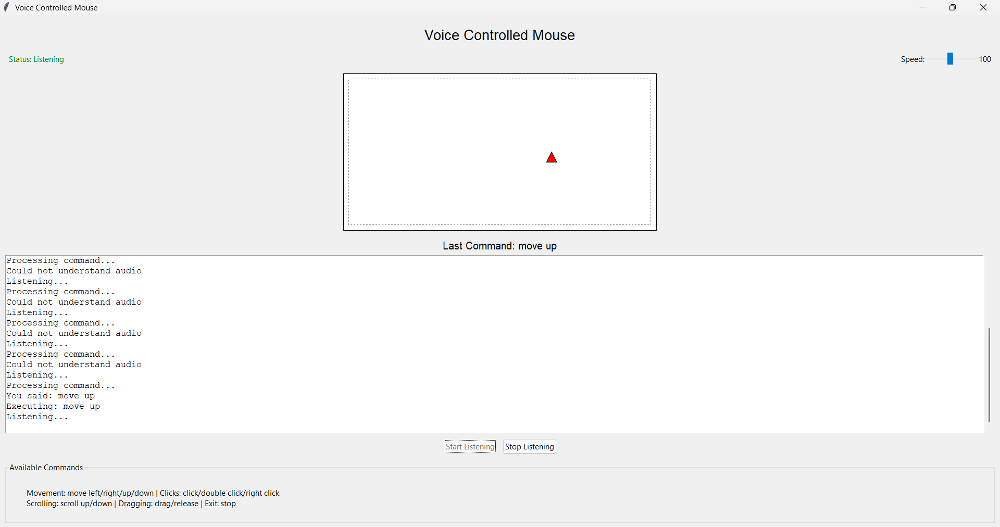

# 🎤 Voice Controlled Mouse 🖱️

This application provides hands-free mouse control using voice commands. It allows users to move the cursor, click, scroll, and perform other mouse actions through spoken instructions. The application features a visual representation of mouse movements and actions for better feedback.

## Demo 
  [Demo Video](demo.mp4)

## ✨ Features

- **Voice-Activated Control**: Navigate with simple voice commands
- **Visual Feedback**: See mouse movements on screen
- **All Mouse Functions**: 
  - Movement (left/right/up/down)
  - Clicks (left/right/double)
  - Scrolling
  - Drag & drop
- **Adjustable Speed**: Control pointer sensitivity
- **Dark Mode UI**: Easy on the eyes

## 🚀 Installation
Ensure you have Python 3.6 or later installed
Install the required packages:
pip install speechrecognition pyautogui
## Usage
Run the application:
python voicemouse.py
## Technical Details
  Uses Google Speech Recognition API for voice-to-text conversion

  Implements a virtual mouse visualization to show actions

  Thread-based listening to prevent UI freezing

  Configurable movement speed (10-200 pixels per command)

  Cross-platform compatibility (Windows, macOS, Linux)

## Requirements
Python 3.6+

speechrecognition package

pyautogui package

tkinter (usually included with Python)

Internet connection (for speech recognition)

Microphone

## Safety Notes
The application includes a failsafe feature - moving the mouse to a corner of the screen will trigger an emergency stop

Voice commands are processed locally until speech recognition occurs

No voice data is stored permanently

## Troubleshooting
If the application doesn't recognize your microphone, check your system audio settings

For poor recognition accuracy, try speaking clearly in a quiet environment

Ensure your internet connection is stable for speech recognition

On Linux, you may need to install additional dependencies for PyAudio

## License
This project is open-source and available under the MIT License.

## Future Improvements
Add custom command mapping

Implement offline speech recognition

Add gesture recognition support

Include more detailed logging and analytics

Add multi-language support
## Acknowledgments
- Initial prototype inspired by [DeepSeek's voice-control implementation](https://github.com/deepseek-ai) (modified for enhanced visual feedback and mouse control precision).

